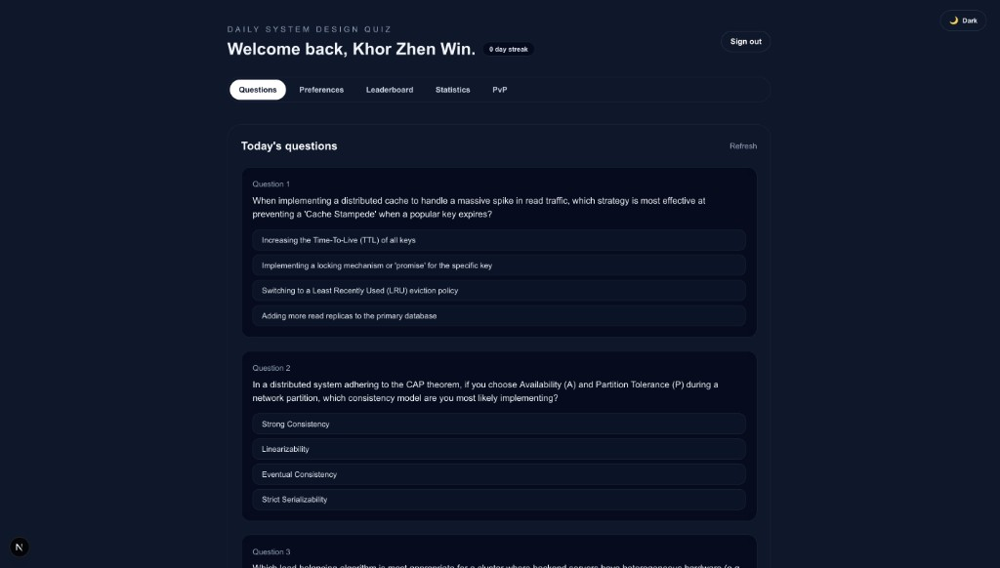
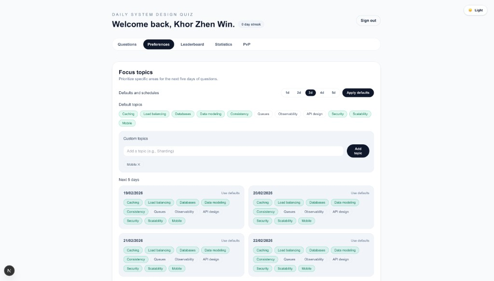
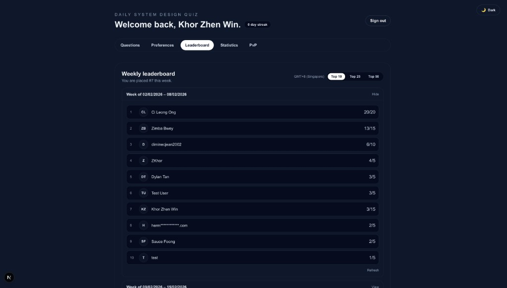
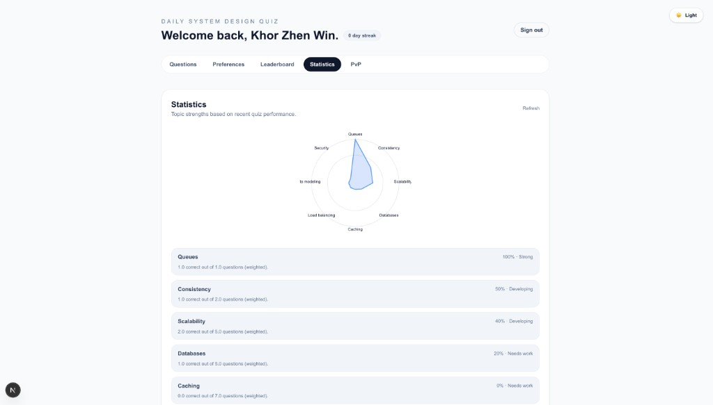
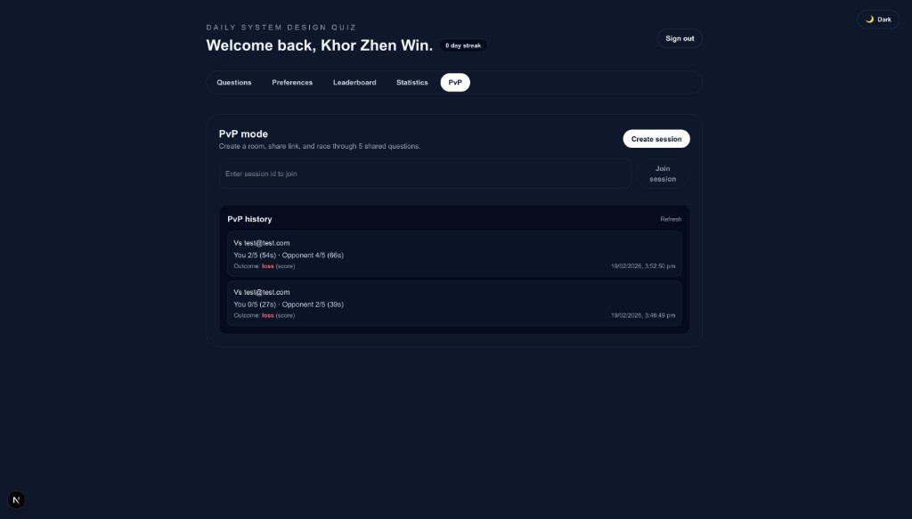
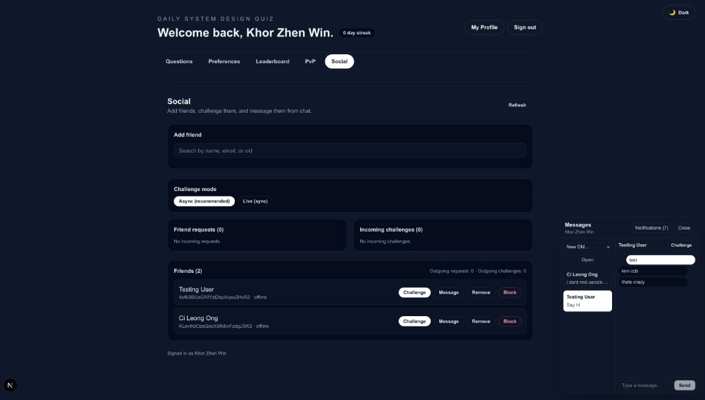

# TenXEng

TenXEng is a Next.js + Firebase app for daily system design practice, social play,
and direct collaboration between friends. It combines AI-generated quizzes,
competitive PvP modes (live + async), and Messenger-style chat.

## Product Screenshots

### Questions (Dark)


### Preferences (Light)


### Leaderboard (Dark)


### Statistics (Light)


### PvP (Dark)


### Social + Chat (Dark)


## Core Features

### Quiz and Learning
- Daily AI-generated system design quiz (5 MCQs + explanations).
- Topic defaults + per-day topic scheduling.
- Embedding-based novelty filtering to reduce repeated question prompts.
- Quiz history with score tracking and streak support.

### Social Layer
- Friend request lifecycle (send, accept, decline, cancel).
- Friend management (remove, block/unblock).
- User search with fuzzy matching across name, email, and UID.
- Presence ping (`lastActiveAt`) for online/offline hints.
- In-app notifications (challenge, chat, request events).

### PvP
- **Live (sync) PvP** sessions.
- **Async PvP** friend challenges (default mode), where each player completes
  independently without blocking on opponent presence.
- Unified PvP history feed with both sync + async results and match type labels.
- Winner resolution by score, then time tiebreaker, then draw.

### Chat
- Floating speech-bubble chat UI.
- Direct messages for friends with unread/read state.
- Typing indicator API and conversation mute support.
- Mobile and desktop layouts with opaque theme-safe surfaces.

## Rate Limiting Algorithm

TenXEng uses a lightweight **in-memory timestamp gate** limiter
(`lib/server/rate-limit.ts`) on social/chat API routes.

### Algorithm details
- Storage: process-level `Map<string, { lastSeenAt: number }>`
- Key: per-user per-endpoint key (for example `uid:friends_get`)
- Rule: allow request only if `now - lastSeenAt >= windowMs`
- Default `windowMs`: `1000` ms (approximately 1 request/second per key)
- Response on block: `allowed: false` + `retryAfterMs`

### Classification (bucket model comparison)
- **Not token bucket**: no token balance, refill rate, or burst capacity.
- **Not leaky bucket**: no queue/drain behavior.
- **Not fixed-window counter**: no per-window request counter.
- **Closest model**: a **deterministic spacing gate** (minimum inter-arrival time
  limiter), which behaves like strict throttling at one accepted request per
  window for each key.

This approach is intentionally simple and effective for single-instance UX
protection. For multi-instance deployments or burst-tolerant quotas, migrate to
Redis-backed token bucket/sliding-window logic.

### Polling-specific limiter (chat + notifications)
- Polling endpoints use a **Firestore-backed sliding-window counter**:
  - `chat_conversations_get`
  - `chat_messages_get`
  - `chat_typing_get`
  - `notifications_get`
- Policy: **15 requests per 10 seconds** per user-per-endpoint key.
- Chat/notification frontend polling cadence is **5 seconds**.
- Internal storage: Firestore collection `__rateLimits` (server-managed via Admin SDK).
- Client access to `__rateLimits` is denied in `firestore.rules`.
- `firestore.indexes.json` includes a field override for `__rateLimits.timestamps`
  to avoid unnecessary indexing of the sliding-window timestamp array.

## Tech Stack

- Next.js App Router + TypeScript
- Firebase Auth (email/password + Google)
- Firestore + Firebase Admin SDK
- Gemini (`gemini-3-flash-preview`) for quiz generation
- Zustand for dashboard UI state
- Vitest + Firebase Emulator for integration testing

## Local Setup

### 1) Environment

Create `.env.local`:

```bash
NEXT_PUBLIC_FIREBASE_API_KEY=
NEXT_PUBLIC_FIREBASE_AUTH_DOMAIN=
NEXT_PUBLIC_FIREBASE_PROJECT_ID=
NEXT_PUBLIC_FIREBASE_STORAGE_BUCKET=
NEXT_PUBLIC_FIREBASE_MESSAGING_SENDER_ID=
NEXT_PUBLIC_FIREBASE_APP_ID=
FIREBASE_PROJECT_ID=
FIREBASE_CLIENT_EMAIL=
FIREBASE_PRIVATE_KEY=
GEMINI_API_KEY=
```

For `FIREBASE_PRIVATE_KEY`, replace line breaks with `\n`.

### 2) Run app

```bash
npm install
npm run dev
```

Open `http://localhost:3000`.

## Testing

Integration tests cover chat, friend requests, sync PvP, async PvP happy paths,
and polling rate-limiter behavior (including `__rateLimits` writes).

Requirements:
- Java Runtime (for Firestore emulator)
- Node + npm

Run:

```bash
npm run test:integration
```

## Firestore Rules and Index Deployment

Deploy security rules and composite indexes:

```bash
./node_modules/.bin/firebase deploy --only firestore:rules,firestore:indexes --project <your-project-id>
```

## Additional Docs

- `docs/social/PRD.md`
- `docs/social/API_CONTRACTS.md`
- `docs/social/REALTIME_AND_RATE_LIMITING.md`
- `docs/social/QA_ROLLOUT.md`
- `docs/social/ASYNC_CHALLENGE_CHECKLIST.md`
- `docs/social/SCREENSHOTS.md`
