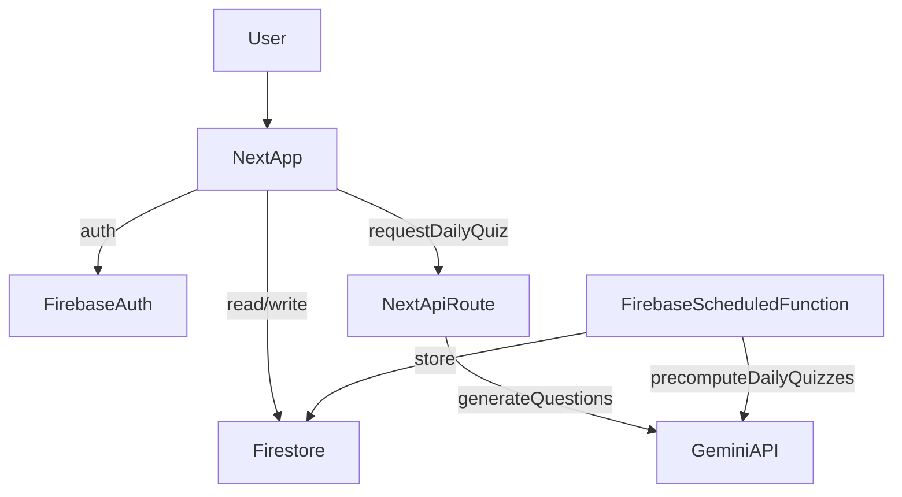

# TenXEng

TenXEng is a Next.js app that delivers daily, AI-generated system design
questions for backend engineers. It uses Firebase Auth + Firestore and Gemini
for question generation.

## Product Screenshots

### Questions (Dark)


### Preferences (Light)


### Leaderboard (Dark)


### Statistics (Light)


### PvP (Dark)


## Features

- Daily AI-generated system design quizzes (5 MCQs with explanations).
- Email/password + Google authentication with session cookies.
- Personalized focus topics with per-day schedules (up to 5 days ahead).
- PvP mode: create or join a 1v1 session, answer the same 5 questions, and
  win by score (time is used as tie-breaker).
- PvP session history with win/loss/draw outcomes and paginated match history.
- Embedding-based novelty filter to reduce repeated questions.
- Weekly leaderboard (GMT+8, Monday start) with rankings and top limits.
- Streak counter for consecutive days completed.
- Light/dark theme toggle and mobile-friendly layout.

## Getting Started

### Environment setup

Create a `.env.local` file with the following variables:

```
NEXT_PUBLIC_FIREBASE_API_KEY=
NEXT_PUBLIC_FIREBASE_AUTH_DOMAIN=
NEXT_PUBLIC_FIREBASE_PROJECT_ID=
NEXT_PUBLIC_FIREBASE_STORAGE_BUCKET=
NEXT_PUBLIC_FIREBASE_MESSAGING_SENDER_ID=
NEXT_PUBLIC_FIREBASE_APP_ID=
FIREBASE_PROJECT_ID=
FIREBASE_CLIENT_EMAIL=
FIREBASE_PRIVATE_KEY=
GEMINI_API_KEY=
```

For `FIREBASE_PRIVATE_KEY`, replace line breaks with `\n`.

### Run the app

First, run the development server:

```bash
npm run dev
# or
yarn dev
# or
pnpm dev
# or
bun dev
```

Open [http://localhost:3000](http://localhost:3000) with your browser to see the result.

This project uses [`next/font`](https://nextjs.org/docs/app/building-your-application/optimizing/fonts) to automatically optimize and load [Geist](https://vercel.com/font), a new font family for Vercel.

## Chat Integration Tests

The repository includes Firestore-backed integration tests for the chat flow:

- create direct conversation between friends
- send message and verify unread count increments
- mark as read and verify unread resets
- reject DM creation for non-friends

Run:

```bash
npm run test:integration
```

Requirements:

- Java Runtime (required by Firebase Firestore emulator)
- Node + npm

## Learn More

To learn more about Next.js, take a look at the following resources:

- [Next.js Documentation](https://nextjs.org/docs) - learn about Next.js features and API.
- [Learn Next.js](https://nextjs.org/learn) - an interactive Next.js tutorial.

You can check out [the Next.js GitHub repository](https://github.com/vercel/next.js) - your feedback and contributions are welcome!

## Deploy on Vercel

The easiest way to deploy your Next.js app is to use the [Vercel Platform](https://vercel.com/new?utm_medium=default-template&filter=next.js&utm_source=create-next-app&utm_campaign=create-next-app-readme) from the creators of Next.js.

Check out our [Next.js deployment documentation](https://nextjs.org/docs/app/building-your-application/deploying) for more details.

## Project Plan (verbatim)

---
name: Next+Firebase Gemini Quiz
overview: Scaffold a Next.js app with Firebase Auth (email + Google), Firestore-backed daily quizzes, and Gemini-powered question generation with a hybrid batch/on-demand pipeline.
todos:
  - id: scaffold-app
    content: Scaffold Next.js app and Firebase config modules
    status: completed
  - id: auth-flows
    content: Implement Firebase Auth UI + profile storage
    status: completed
    dependencies:
      - scaffold-app
  - id: quiz-generation
    content: Build Gemini API route with schema validation
    status: completed
    dependencies:
      - scaffold-app
  - id: scheduler
    content: Add Firebase scheduled function for daily precompute
    status: completed
    dependencies:
      - quiz-generation
  - id: dashboard-ui
    content: Create dashboard quiz UI + history + scoring
    status: completed
    dependencies:
      - auth-flows
      - quiz-generation
  - id: security-rules
    content: Add Firestore rules and rate limiting
    status: completed
    dependencies:
      - auth-flows
      - quiz-generation
---

# Next+Firebase Gemini Quiz

## Scope

- Next.js (App Router, TypeScript) app with Firebase Auth (email/password + Google), protected dashboard, and quiz history.
- Gemini `gemini-3-flash-preview` generates 5 system-design MCQs per day with explanations.
- Firestore stores users, daily quizzes, and results; scheduled function precomputes for active users with on-demand fallback.

## Architecture



## Data Model (Firestore)

- `users/{uid}`: profile, timezone, lastActiveAt.
- `users/{uid}/dailyQuizzes/{yyyyMMdd}`: questions[], answers[], explanations[], generatedAt.
- `users/{uid}/quizResults/{quizId}`: selectedAnswers, score, completedAt.
- `users/{uid}/topicSchedules/{yyyyMMdd}`: topics[], createdAt.
- `users/{uid}/questionHistory`: prompt history + embeddings for novelty filter.
- `leaderboards/{weekStart}`: topEntries[], weekEndKey, updatedAt.

## Implementation Steps

1. Scaffold Next.js app with App Router and Firebase client SDK; add env handling and shared config modules.

   - Create `[app]/(auth)/login/page.tsx`, `[app]/(auth)/signup/page.tsx`, `[app]/(dashboard)/page.tsx`.
   - Add `lib/firebase/client.ts`, `lib/firebase/admin.ts` (server-only), and `middleware.ts` for route protection.

2. Implement Auth UI and flows.

   - Email/password signup/login + Google OAuth.
   - Save user profile in `users/{uid}` with timezone on first login.

3. Build Gemini generation API route.

   - Add `app/api/daily-quiz/route.ts` to generate/return today’s quiz.
   - Use strict JSON schema for 5 MCQs; validate and store in Firestore.
   - Server-only access to `GEMINI_API_KEY` (never in client bundle).

4. Add hybrid scheduling.

   - Create Firebase Functions (scheduled) to precompute quizzes for recently active users.
   - Fallback to on-demand generation in API route when a quiz is missing.

5. Create dashboard UI.

   - Show today’s quiz, scoring, and history list with per-day results.

6. Security + rules.

   - Firestore security rules for per-user access.
   - Basic rate limiting (per-user per-day) in API route and function.

## Key Files

- `[app]/app/api/daily-quiz/route.ts`
- `[app]/lib/firebase/client.ts`
- `[app]/lib/firebase/admin.ts`
- `[app]/app/(auth)/login/page.tsx`
- `[app]/app/(auth)/signup/page.tsx`
- `[app]/app/(dashboard)/page.tsx`
- `[app]/functions/src/index.ts` (scheduled function)
- `[app]/firestore.rules`

## Notes

- Rotate the exposed Gemini API key and store it in `.env.local` and Firebase config.
- Store timezone on signup for daily boundary handling.

## Focus Topics

Users can set default topics and override per day (up to 5 days ahead). The
daily quiz prompt is biased toward the scheduled topics and the selected topics
are stored alongside the quiz for auditability.

## Weekly Leaderboard

- Computed weekly (Monday–Sunday) in GMT+8 (Singapore).
- Rankings ordered by: correct answers desc → accuracy desc → total desc.
- Leaderboard shows only weeks in the current month.

## Embedding-Based Novelty Filter

To reduce repeats, the daily quiz endpoint computes embeddings for each
question and compares them against the user’s history.

**How it works**
- Each prompt is embedded with `gemini-embedding-001` (fallback: `text-embedding-004`).
- Vectors are normalized to unit length.
- Cosine similarity becomes a dot product of the normalized vectors.
- If any question is too similar (>= 0.85) or an exact match, the quiz is
  regenerated (up to 3 retries).

**Storage**
- Per-user history is stored in `users/{uid}/questionHistory`:
  - `prompt`, `promptNormalized`, `embedding`, `dateKey`, `createdAt`
